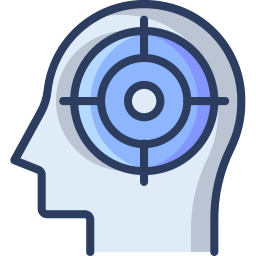
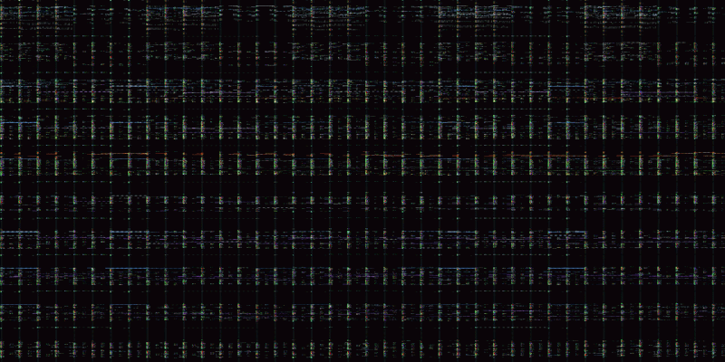

<p align="center">
  
</p>

<h2 align="center"> Prompt Repetition: Real GPT-2 Attention Visualizer</h2>
<h3 align="center">Bi-Directional Attention Matrix Visualizer - Baseline vs Repeated Prompting</h3>

<p align="center">
  
  
  
  
  
</p>

Based on *[Prompt Repetition Improves Non-Reasoning LLMs](https://arxiv.org/pdf/2512.14982)* - Leviathan, Kalman & Matias (Google Research, Dec 2025).

According to the paper, `[prompt | prompt]` format in non-resoning LLMs wins on **47/70** benchmark-model combinations with no fine-tuning or extra inference calls. By running **GPT-2 small** (124M params) this tool attempts to visualize the real attention matrices behind that gain.

🤗 [Experiment this Space here](https://huggingface.co/spaces/joaoaapinho/prompt_repetition_visualizer) 🤗

---

## Scope

<p align="center">
  
</p>

| Panel | What it displays |
|---|---|
| Baseline | Standard causal (lower-triangular) attention for a single prompt |
| Cross-copy | Copy-2 attending to Copy-1 - the new channel repetition unlocks |
| Difference | Row-normalized gain/loss per token pair (green = gained, red = lost) |
| Self-copy | Copy-2 attending to itself |
| Magnitude | Absolute shift - which token pairs change most |
| Entropy chart | Attention focus vs. diffuseness per token, baseline vs. repeated |

---

## Methodology

### 1. Attention extraction

GPT-2 uses masked scaled dot-product attention. For each layer $l$ and head $h$:

$$A^{(l,h)} = \text{softmax}\!\left(\frac{Q^{(l,h)}{K^{(l,h)}}^\top}{\sqrt{d_k}} + M\right)$$

where $M_{ij} = -\infty$ if $j > i$ (causal mask), else $0$, and $d_k = 64$ for GPT-2 small.

Aggregated across all $L = 12$ layers and $H = 12$ heads:

$$\bar{A} = \frac{1}{L \cdot H} \sum_{l=1}^{L} \sum_{h=1}^{H} A^{(l,h)} \in \mathbb{R}^{n \times n}$$

### 2. Repeated condition

For the repeated prompt `[prompt | prompt]`, the input length doubles to $2n$. The full attention matrix $\bar{A} \in \mathbb{R}^{2n \times 2n}$ is partitioned into four $n \times n$ blocks:

$$\bar{A} = \begin{pmatrix} A^{c_1 \to c_1} & 0 \\ A^{\text{cross}} & A^{c_2 \to c_2} \end{pmatrix}$$

The upper-right block is zero by the causal mask. The two blocks of interest are:

$$A^{\text{cross}} = \bar{A}[n{:}2n,\; 0{:}n] \qquad \text{(copy-2 queries → copy-1 keys)}$$
$$A^{\text{self}} = \bar{A}[n{:}2n,\; n{:}2n] \qquad \text{(copy-2 queries → copy-2 keys)}$$

### 3. Row normalisation

$A^{\text{cross}}$ rows sum to $\approx 0.5$ - the softmax is computed over $2n$ positions but only $n$ keys are in range. Both matrices are row-normalised before comparison so each distribution sums to 1:

$$\hat{A}_{i,\cdot} = \frac{A_{i,\cdot}}{\displaystyle\sum_k A_{i,k}}$$

### 4. Difference and magnitude

$$D_{i,j} = \hat{A}^{\text{cross}}_{i,j} - \hat{A}^{\text{single}}_{i,j}$$

$$\text{Magnitude}_{i,j} = \lvert D_{i,j} \rvert$$

### 5. Entropy and concentration

Normalised Shannon entropy per query token (0 = fully focused, 1 = uniform):

$$H_i = \frac{-\displaystyle\sum_j \hat{A}_{i,j} \log \hat{A}_{i,j}}{\log n}$$

Top-K concentration (fraction of attention mass on the $k = 3$ most-attended keys):

$$C_i = \sum_{j \,\in\, \text{top-}k(\hat{A}_{i,\cdot})} \hat{A}_{i,j}$$

---

## Key Findings

**1. Repetition unlocks de-facto bidirectional context**
In the baseline, the causal mask restricts token $i$ to attend only to positions $j \leq i$. When the prompt is doubled, every copy-2 token can attend to every copy-1 token - including tokens that appear later in the original sequence - without any architecture change.

**2. Early-token attention dominance shifts**
In the baseline, early query tokens are forced to concentrate their attention mass on a small number of available keys, creating an artificial dominance pattern. In the cross-copy condition, attention distributes more evenly across all $n$ keys, making semantically richer and later-occurring tokens reachable from any query position.

**3. Low baseline entropy is a causal-mask artefact, not model confidence**
Early query tokens in the baseline show very low $H_i$ simply because few keys are in range - the distribution is narrow by construction, not by choice. Cross-copy entropy is higher on average but more consistent across positions, reflecting genuinely unconstrained access rather than forced sparsity.

**4. Repetition equalises attention concentration across token positions**
The top-3 concentration becomes more uniform across all prompt words under repetition. This matters most for retrieval and index-lookup tasks, where the relevant key may be far from the query in the original sequence.

---

## Run locally

```bash
# 1. Create and activate a virtual environment
python3 -m venv .venv
source .venv/bin/activate

# 2. Install dependencies
pip install -r requirements.txt

# 3. Run
python prompt_repetition_visualizer.py
```

App serves at **http://localhost:8080**. First run downloads GPT-2 (~500 MB, cached after that).
